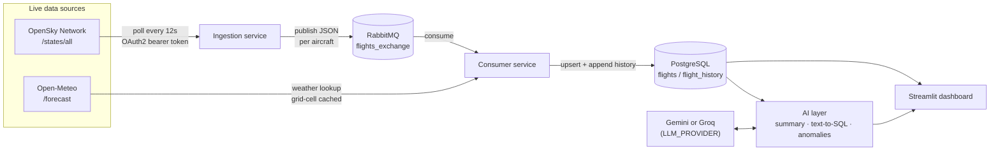

# Real-Time Flight Data Integration Hub with AI

[](https://github.com/yobage/OpenSkyOpenMeteo/actions/workflows/ci.yml)

Two live public data sources — flight positions and weather — integrated in
real time through a message queue, normalized into PostgreSQL, with an AI
layer for natural-language situational summaries, free-text querying, and
anomaly detection, plus a live Streamlit dashboard. Runs entirely on free
tiers with `docker compose up`.

## Why this project

This mirrors a common shape of real-world enterprise integration work: pull
from multiple live external sources, decouple ingestion from processing with
a message broker (the same pattern JMS/EMS/IBM MQ solve in enterprise
stacks), transform/normalize heterogeneous JSON into a relational schema, and
serve it back out — here with a modern AI layer on top instead of a
traditional BI report. The interesting engineering is in the seams: OAuth2
token lifecycle management, rate-limit backoff, caching to avoid hammering a
downstream API, exactly the kind of upsert-vs-append schema design real
systems need, and — since an LLM is now in the request path — treating
LLM-generated SQL as untrusted input rather than trusting the model's own
claim that a query is safe.

## Architecture



| Stage | What it does |
|---|---|
| **Ingestion** (`src/ingestion`) | OAuth2 client-credentials auth to OpenSky with automatic token refresh (falls back to anonymous access if no credentials are set), polls `/states/all` for a bounding box, parses the index-based state-vector arrays into typed models, publishes to RabbitMQ. |
| **RabbitMQ** | Durable direct exchange decoupling ingestion from processing — either side can be down or slow without losing data or blocking the other. |
| **Consumer** (`src/consumer`) | Enriches each flight with current weather from Open-Meteo (cached per lat/lon grid cell), normalizes into a unified schema, upserts a current snapshot and appends to history in PostgreSQL. |
| **PostgreSQL** (`db/init.sql`) | `flights` (current snapshot, keyed by `icao24`) + `flight_history` (append-only), with geo/trajectory indexes. |
| **AI layer** (`src/ai`) | Provider-agnostic (`LLM_PROVIDER=gemini\|groq`, no code change to switch). Situational summaries narrate deterministically-computed stats. Text-to-SQL generates a query, then validates it with `sqlparse` before ever executing it — SELECT-only, no writes/DDL/stacked statements/catalog access. Anomaly detection (low altitude, rapid vertical rate, holding-pattern geometry) is rule-based; the LLM only explains findings afterward. |
| **Dashboard** (`src/dashboard`) | Streamlit app: live map colored by altitude, weather table, AI summary/anomaly panels, and a free-text Q&A box — all wired to the pieces above. |

## Getting started

Requires [Docker](https://docs.docker.com/get-docker/) with Compose. Nothing
else to install — everything runs in containers.

```bash
git clone https://github.com/yobage/OpenSkyOpenMeteo.git
cd OpenSkyOpenMeteo
cp .env.example .env
docker compose up --build
```

Then open:

- **Dashboard** — http://localhost:8501
- **RabbitMQ management UI** — http://localhost:15672 (`guest`/`guest`)

The stack works out of the box with anonymous OpenSky access and no LLM key
(the dashboard's map/table still work; AI panels show a note instead of
failing). For the full experience, fill in `.env`:

### Free OpenSky credentials (optional, higher rate limits)

1. Create a free account at [opensky-network.org](https://opensky-network.org/index.php?option=com_users&view=registration).
2. Go to [My OpenSky → API Client](https://opensky-network.org/my-opensky) and create an API client to get a `client_id` / `client_secret`.
3. Put them in `.env` as `OPENSKY_CLIENT_ID` / `OPENSKY_CLIENT_SECRET`.

### Free LLM credentials (required for the AI panels)

Pick one — both have generous free tiers and need no credit card:

- **Gemini**: get a key at [aistudio.google.com/apikey](https://aistudio.google.com/apikey), set `GEMINI_API_KEY`.
- **Groq**: get a key at [console.groq.com/keys](https://console.groq.com/keys), set `GROQ_API_KEY`.

Set `LLM_PROVIDER` to whichever you used — switching providers later is a
one-line env change, no code change.

## Project structure

```
├── db/init.sql              # schema: flights, flight_history, indexes
├── src/
│   ├── common/               # shared config, models, logging, heartbeat
│   ├── ingestion/             # OpenSky auth + polling -> RabbitMQ
│   ├── consumer/              # RabbitMQ -> weather enrichment -> Postgres
│   ├── ai/                   # LLM provider abstraction, summary, text-to-SQL, anomalies
│   └── dashboard/             # Streamlit app
├── tests/                    # state-vector parsing, SQL safety, weather cache, heartbeat
├── docker-compose.yml         # rabbitmq, postgres, ingestion, consumer, dashboard
└── .github/workflows/ci.yml   # ruff + pytest on push
```

## Local development

```bash
python -m venv .venv
source .venv/Scripts/activate   # .venv\Scripts\Activate.ps1 on Windows PowerShell
pip install -e ".[dev]"
pytest
ruff check .
```

Each service can also run standalone against infra started with
`docker compose up rabbitmq postgres`:

```bash
PYTHONPATH=src python -m ingestion.main
PYTHONPATH=src python -m consumer.main
PYTHONPATH=src streamlit run src/dashboard/app.py
```

## Design notes

A few decisions worth calling out to a reviewer:

- **SQL safety is enforced in code, not by prompting.** The LLM's claim that
  a generated query is read-only is never trusted; `ai/text_to_sql.py` parses
  every query with `sqlparse` and rejects anything but a single plain
  `SELECT` (see `tests/test_sql_safety.py` for the attack surface covered).
- **Weather is grid-cached, not per-flight.** Nearby aircraft share one
  Open-Meteo lookup per coarse lat/lon cell (`consumer/weather.py`), so a busy
  poll cycle costs a handful of HTTP calls, not one per aircraft.
- **Deterministic first, LLM second.** Situational-summary stats and anomaly
  detection are computed in plain Python; the LLM only narrates/explains
  already-computed facts, so it can't invent numbers that weren't given to it.
- **Workers healthcheck via heartbeat file, not a port.** Ingestion and
  consumer have no HTTP endpoint, so each touches `/tmp/healthy` on every
  successful work cycle; the container `HEALTHCHECK` just checks its mtime.
